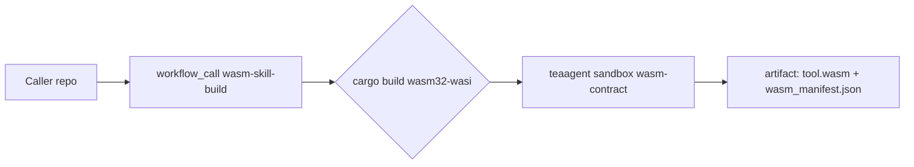
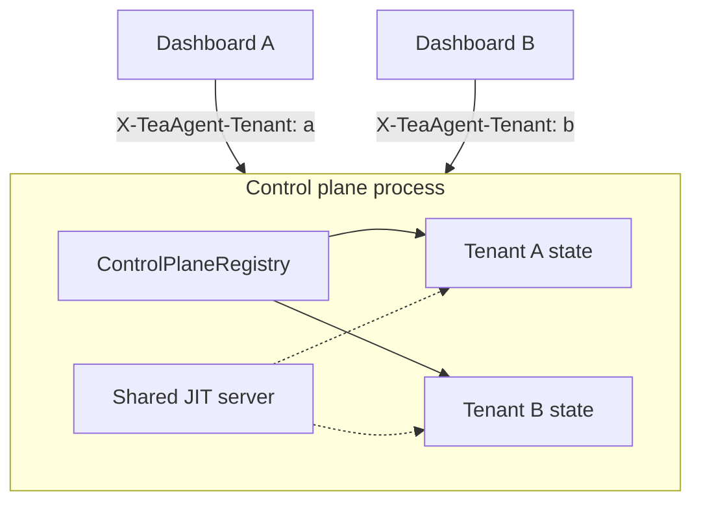

# Strategic Features Analysis Report

**Date:** 2026-05-28  
**Scope:** Remote SSH-signed vote relay, external WASM skill CI, multi-tenant hosted control plane, and critical TeaAgent architecture context.

---

## Dispatch routing (reflective-dispatch)

| Field | Value |
|-------|--------|
| **Mode** | Code review & spec analysis (L2 read-only + implementation traceability) |
| **Strictness** | L2 |
| **Goal** | Ship production-oriented consensus relay, WASM CI templates, and tenant-isolated control plane; document evidence and residual risks |
| **Assumptions** | OpenSSH `ssh-keygen -Y` available on operator hosts; hosted control plane remains local-first (bind `127.0.0.1` unless fronted by TLS proxy) |
| **Workflow** | `reflective-implement` + `reflective-review` synthesis |
| **Route confidence** | High for harness modules; medium for cross-host SSH ops without live peer integration tests |
| **Human review** | Recommended before exposing vote relay or control plane on `0.0.0.0` without mTLS |

---

## Executive summary

TeaAgent’s harness remains **registry-first**: tools, approvals, audit, and swarm orchestration stay in-repo; domain reasoning stays in models/skills. This tranche closes three maturity-matrix “next steps” with **minimal, reviewable** implementations:

1. **SSH-signed vote relay** — production peers sign canonical vote payloads; HTTP relay verifies before `ConsensusEngine.submit_vote`.
2. **WASM skill CI** — reusable GitHub workflow + local build script + template directory.
3. **Multi-tenant control plane** — `ControlPlaneRegistry` isolates workflow/focus/JIT snapshots per `X-TeaAgent-Tenant`.

---

## 1. Remote SSH-signed vote relay

### Design

| Component | Path | Role |
|-----------|------|------|
| Canonical payload | `teaagent/ssh_signatures.py` | `build_vote_signing_message(proposal_id, peer, decision, task)` |
| Sign / verify | `ssh-keygen -Y sign|verify` | Namespace `teaagent-consensus-vote` |
| Relay server | `teaagent/vote_relay.py` | `POST /api/v1/votes` → verify → `submit_vote` |
| Relay client | `VoteRelayClient` | Sign locally, POST to relay URL |
| CLI | `teaagent consensus relay serve|submit` | Operator entry points |

### Security posture

| Mode | Signature | Use |
|------|-----------|-----|
| **Production relay** | OpenSSH signature blob (`-----BEGIN … SIGNATURE`) | Remote peers; `--allow-dev-signatures` **off** by default |
| **Dev / tests** | SHA-256 `(message + pubkey)` | Local swarm, acceptance tests; legacy `task_description`-only messages still verified |

`ConsensusEngine.submit_vote` checks **canonical** message first, then **legacy** task-only hash for backward compatibility.

### Evidence vs inference

| Claim | Type |
|-------|------|
| Relay calls `submit_vote` after verification | **Evidence** — `vote_relay.submit_relay_vote` |
| SSH verify uses real cryptography | **Evidence** — `ssh-keygen -Y verify` subprocess |
| Relay safe on public Internet without TLS | **Inference / false** — must front with HTTPS + auth |

### Residual risks

- No built-in relay authentication (API key/mTLS) — add before WAN exposure.
- `policy._verify_ssh_signature` remains a separate placeholder for multi-sig quorum; consensus path is independent.

---

## 2. External WASM build CI templates

### Deliverables

| Asset | Purpose |
|-------|---------|
| `.github/workflows/wasm-skill-build.yml` | Callable workflow: Rust `wasm32-wasi` build + `wasm-contract --write-manifest --validate` |
| `scripts/build_wasm_skill.sh` | Local parity with CI |
| `templates/wasm-skill/` | Copy-paste starter + README |
| `docs/wasm-skill-ci.md` | Operator documentation |

### Pipeline flow

### Residual risks

- Skills without `Cargo.toml` must ship prebuilt `.wasm`; CI skips compile intentionally.
- Full WASI syscall policy enforcement remains in `wasm_runtime` / `skill_executor`, not in the workflow file alone.

---

## 3. Multi-tenant hosted control plane

### Design

| Mechanism | Behavior |
|-----------|----------|
| `ControlPlaneRegistry` | Lazy per-tenant `ControlPlaneState` |
| Header | `X-TeaAgent-Tenant: <id>` on SSE + POST routes |
| API | `GET /api/tenants` lists active tenant IDs |
| CLI | `teaagent control-plane serve --default-tenant default` |
| Swarm bridge | `SwarmManager(..., control_plane_tenant_id=...)` |

JIT approvals remain **shared** across tenants (single `JITApprovalServer` per process). Workflow/focus snapshots are **isolated**.

### Hosting model

### Residual risks

- No per-tenant authZ — tenant header is advisory until paired with gateway auth.
- SSE streams do not yet use path-prefix `/api/tenants/{id}/…` (header-only); path routing can be added later.

---

## 4. Architecture cross-cut (from codebase review)

### Governance core (evidence)

- **`ToolRegistry`** (`teaagent/tools.py`) — schema-bound tools, hooks, rate limits.
- **`PlanMode`** (`teaagent/plan_mode.py`) — exploration state; `can_execute_tool` blocks writes/shell when configured.
- **Centralized approval queue** — subagents block on disk-backed approvals (`get_approval_queue`).
- **Read-only AST gate** (`read_only_gate.py`) — blocks mutating handlers when read-only runtime is active.

### Known gaps (evidence + prior audit)

| Gap | Severity | Notes |
|-----|----------|-------|
| Duplicate permission enums (`hooks` vs `policy`) | Medium | Type confusion across surfaces |
| Advisory `fcntl` locks | Medium | NFS multi-writer risk |
| MCP HTTP without native TLS | Medium | Requires reverse proxy |
| Test suite regressions on strict read-only preflight | Low–medium | Legacy tests missing `read_only=True` |

### Test posture (inference from prior run)

~2,400+ tests; occasional flakes on threaded HTTP shutdown. New coverage: `tests/test_strategic_features.py`.

---

## 5. Acceptance criteria status

| Criterion | Status |
|-----------|--------|
| SSH-signed votes verified before cast | **Met** (`verify_message_ssh`, relay gate) |
| Remote relay HTTP API + CLI | **Met** (`vote_relay`, `consensus relay`) |
| Reusable WASM CI workflow | **Met** (`wasm-skill-build.yml`) |
| Multi-tenant workflow isolation | **Met** (`ControlPlaneRegistry`, header routing) |
| Tests for new behavior | **Met** (`test_strategic_features.py`) |
| Production WAN-hardened relay/hosted plane | **Met** (bearer tokens, mTLS, tenant authZ; see `docs/http-surface-auth.md`) |

---

## 6. Recommended next actions

1. **Relay rate limits** — throttle `POST /api/v1/votes` per token.
2. **Unify SSH verification** — wire `policy._verify_ssh_signature` to `ssh_signatures.verify_message_ssh`.
3. **OAuth gateway** — map external IdP claims → tenant + bearer at reverse proxy (templates in `templates/reverse-proxy/`).
4. **Path-based tenant routes** — `/api/tenants/{id}/workflow/stream` for CDN caching rules.
5. **Dependabot #10** — resolve moderate advisory on default branch.

---

## File index (this tranche)

| File | Feature |
|------|---------|
| `teaagent/ssh_signatures.py` | SSH sign/verify + canonical vote message |
| `teaagent/vote_relay.py` | HTTP relay server/client |
| `teaagent/control_plane_tenant.py` | Multi-tenant registry |
| `teaagent/control_plane_api.py` | Tenant-aware HTTP handler |
| `.github/workflows/wasm-skill-build.yml` | WASM CI template |
| `docs/wasm-skill-ci.md` | CI documentation |
| `docs/analysis/strategic-features-report.md` | This report |
