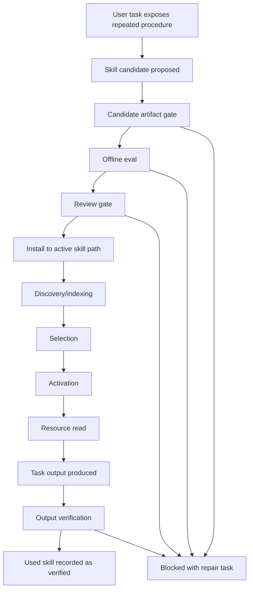
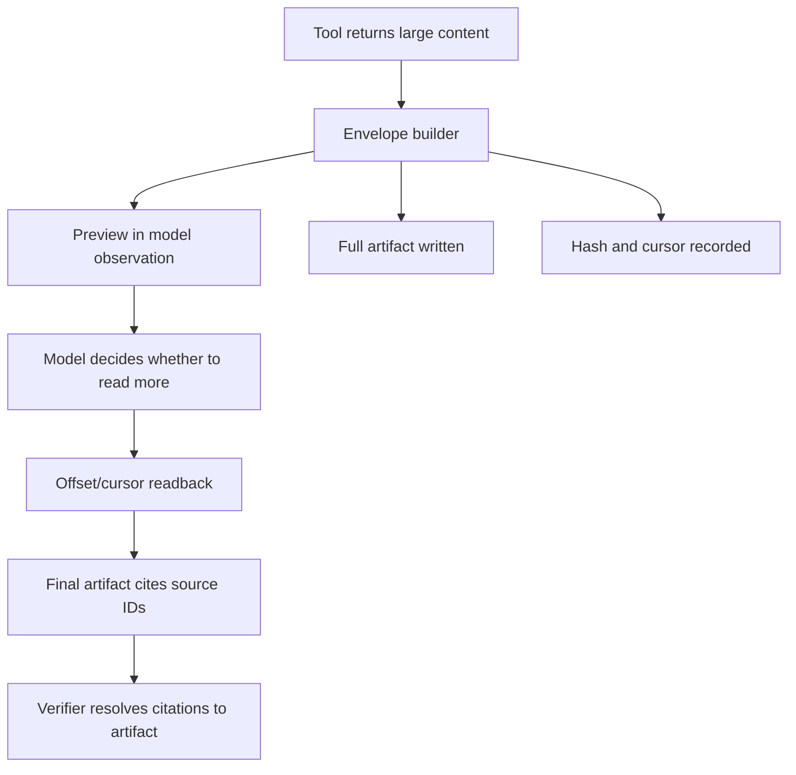

# Dynamic Skill Lifecycle And Result Flow - 2026-06-05

## Purpose

This document defines the target architecture for dynamic skills and long tool
results. It is written as an implementation guide for future code changes, but
it intentionally records behavior rather than committing to exact class names.

## Design Goal

TeaAgent should support self-extension without losing trust.

A generated skill must move through a visible lifecycle before it becomes
trusted persistent memory. A long result must remain recoverable after the model
receives only a preview. A final artifact must be verifiable against its source
evidence.

## Lifecycle Overview



## State Vocabulary

| State | Meaning | Evidence owner |
| --- | --- | --- |
| `candidate_proposed` | A new skill bundle exists in quarantine. | skill candidate store |
| `candidate_artifacts_valid` | Required files and schemas exist. | candidate artifact validator |
| `candidate_eval_passed` | Offline checks pass. | skill eval |
| `review_passed` | Review policy allows install. | skill candidate review |
| `installed` | Bundle is copied to an active skill path with provenance. | installer |
| `discovered` | Loader found a `SKILL.md`. | skill loader |
| `indexed` | Metadata is available without full resource injection. | skill loader |
| `selected` | User/config/model selected the skill for the task. | runner/chat/TUI |
| `activated` | Full skill instructions are made task-active. | runner/chat/TUI |
| `resource_read` | References, scripts, or assets were read. | workspace/tool audit |
| `used_in_run` | Runtime action references the skill for output. | runner/audit |
| `output_verified` | Deterministic checks passed for final artifact. | verifier |
| `superseded` | Newer skill or decision replaces this one. | skill governance |
| `blocked` | Lifecycle cannot proceed without repair/review. | owning component |

## Skill Source Types

| Source type | Example | Trust interpretation |
| --- | --- | --- |
| Candidate installed | `.config/agent/skills/rss-summary` with provenance | Reviewed TeaAgent project skill. |
| Direct project skill | `.config/agent/skills/foo` without candidate provenance | Active but unmanaged. |
| Compatibility skill | `.opencode/skill/foo` or `.claude/skills/foo` | Discoverable for compatibility, not TeaAgent-reviewed by default. |
| User skill | `~/.config/agent/skills/foo` | User-owned; project cannot assume review state. |
| Executable skill tool | Skill with `tool.py`, Docker, or WASM execution path | Requires sandbox and permission interpretation. |

`skill explain` should expose the source type and governance status for each
loaded skill.

## Candidate-To-Install Flow

Expected candidate bundle:

- `SKILL.md`
- `REFERENCE.md`
- `tool_call_contract.json`
- `cost_profile.json`
- `interaction_policy.json`
- `provenance.json`
- optional `eval_dataset.json`
- optional scripts/assets

Install rules:

- Project install target is `.config/agent/skills/<name>`.
- Install writes provenance next to `SKILL.md`.
- Candidate origin and install scope are preserved.
- Personal install requires explicit attestation.
- Direct writes to active skill paths are blocked, quarantined, or labeled
  unmanaged.

## Activation Flow

Activation should be explainable by cause:

| Cause | Meaning |
| --- | --- |
| `user_explicit` | User named the skill directly. |
| `config_selected` | Project or run config selected the skill. |
| `model_selected` | Model requested activation through a governed tool. |
| `eager` | Full prompt mode loaded the skill automatically. |
| `compatibility` | Skill was available through compatibility discovery. |

Recommended first implementation:

- Support `user_explicit` and `config_selected` as reliable activation causes.
- Add `model_selected` only after audit and failure handling are stable.

## Long Result Flow



Minimum envelope:

```json
{
  "content_type": "text/markdown",
  "preview": "...",
  "truncated": true,
  "total_bytes": 123456,
  "preview_bytes": 50000,
  "artifact_path": ".teaagent/artifacts/tool-results/run-id/tool-id.txt",
  "content_hash": "sha256:...",
  "cursor": "offset:50000",
  "suggested_next_action": "read artifact_path with offset cursor"
}
```

Invariant:

- A final answer must not cite source content that cannot be resolved to either
  the preview or the full artifact.

## RSS Example Flow

1. User asks for RSS summary skill.
2. Agent proposes `rss-summary` candidate.
3. Candidate artifacts are validated.
4. Offline RSS fixture eval runs.
5. Candidate installs to `.config/agent/skills/rss-summary`.
6. Later run activates `rss-summary`.
7. OPML and feed XML files are read.
8. Large feed content returns a long-result envelope.
9. The model reads additional offsets if needed.
10. The final markdown file is written.
11. Validator checks source titles, URLs, categories, dates, and injection
    resistance.
12. Audit records `output_verified`.

## Failure States

| Failure | Required response |
| --- | --- |
| Candidate artifacts missing | Block install and list missing files. |
| Eval fails | Keep candidate quarantined and write repair task. |
| Direct active write attempted | Block or quarantine; explain candidate path. |
| Skill selected but activation fails | Record blocked state and show user recovery. |
| Long result truncated without artifact | Fail the tool result contract. |
| Final output lacks source evidence | Mark output verification failed. |
| Invalid model decision JSON | Fail visible workspace task; do not claim skill success. |

## Audit Requirements

Audit payloads should include:

- skill name
- source path
- source type
- governance status
- lifecycle state
- activation cause
- run ID
- token estimate when relevant
- artifact paths
- content hashes for long results
- verification result

Do not store secrets in audit payloads.

## UX Requirements

CLI and TUI should be able to answer:

- Which skill was used?
- Where did it come from?
- Was it reviewed or unmanaged?
- Was it explicitly activated?
- Did it read references/scripts?
- Did it produce a verified artifact?
- If it failed, what is the next repair action?

User-facing summaries should collapse detailed lifecycle states into simple
labels:

- Available
- Active
- Used
- Verified
- Blocked
- Unmanaged

## Compatibility Requirements

- Existing skill discovery paths should remain readable for compatibility.
- Compatibility does not imply TeaAgent review.
- Existing small tool outputs should not need envelopes.
- The envelope applies when output crosses a configured size threshold or when a
  tool declares source-backed evidence.

## Implementation Sequence

1. Add state vocabulary and audit event names.
2. Update `skill explain` to surface governance and source type.
3. Protect active skill write paths.
4. Add RSS fixture test and validators.
5. Add long-result envelope helper.
6. Add readback by cursor.
7. Add TUI/CLI display refinements.

## Acceptance Criteria

- A loaded-only skill is not reported as used.
- A direct `.opencode/skill` write is not silently accepted as governed.
- A candidate-installed skill carries provenance.
- A large result has preview, artifact path, hash, and cursor.
- RSS fixture output is mechanically checked.
- Run evidence can show the full path from skill activation to verified output.

## Open Design Defaults

Use these defaults unless a later ADR changes them:

- Canonical project install path: `.config/agent/skills/<name>`.
- Direct active writes: blocked or quarantined by default.
- Real-model dynamic skill evals: optional profile, not PR-blocking at first.
- Deterministic fixture evals: PR-blocking once stable.
- Long-result artifact path: under `.teaagent/artifacts/tool-results/`.

## Conclusion

Dynamic skills should not be treated as prompt snippets that happen to live on
disk. They are persistent behavior changes. Persistent behavior changes need
state, review, evidence, and rollback. Long results are not prompt overflow;
they are source evidence that must remain inspectable.
