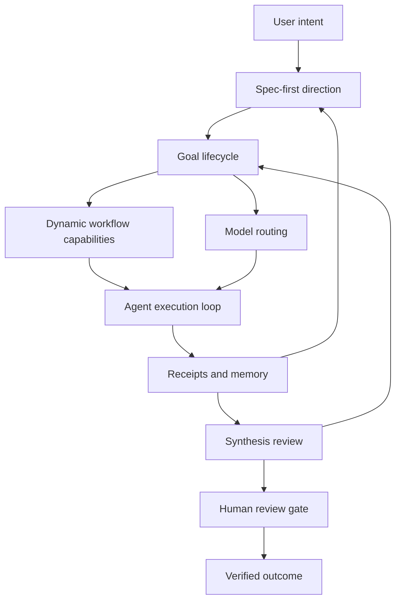

# Seven Control Loops TeaAgent Integration Map - 2026-06-05

## Purpose

This map connects the seven control loops to TeaAgent's current architecture.
It records what already exists, what is adjacent but not systematized, and what
should be added.

## Control Loop Architecture

## Loop 1: Spec-First Direction

Current TeaAgent surfaces:

- `docs/specs/`
- `teaagent/plan.py`
- `teaagent/plan_mode.py`
- `teaagent/plan_storage.py`
- `teaagent/governance/plan_gate.py`
- `docs/specs/plan-review-revision-spec-2026-05-31.md`

Current strengths:

- The project already values plan-before-write.
- Plans and specs are durable markdown artifacts.
- Governance docs already say specs should have acceptance criteria and
  non-goals.

Gap:

- Specs are not yet a uniformly enforced run contract.
- Execution does not always record a spec hash.
- Spec artifacts are not always validated against current repo facts.

Recommended integration:

- Add `spec_id` and `spec_hash` to run metadata when a run is spec-bound.
- Add a "spec exemption" field for small tasks.
- Add a read-only repository grounding check before moving from spec to plan.
- Add tests that reject mutating high-risk runs without spec or exemption.

## Loop 2: Dynamic Workflow Breadth

Current TeaAgent surfaces:

- `teaagent/skill_loader.py`
- `teaagent/skill_candidates.py`
- `teaagent/skill_candidate_artifacts.py`
- `teaagent/skill_eval.py`
- `teaagent/skill_writer.py`
- ToolRegistry and MCP surfaces
- Dynamic skill docs created on 2026-06-05

Current strengths:

- Candidate bundles already create a safer path than direct self-modification.
- Skill explainability is being hardened.
- Tool governance already requires schemas and annotations.

Gap:

- Direct active skill writes are not fully blocked.
- Skill use is not yet proven separately from skill load.
- Runtime reload/test/refine loop is slower than Pi-like systems.

Recommended integration:

- Protect active skill directories.
- Add skill lifecycle events.
- Add a fast candidate test loop for local skill development.
- Make generated workflows auditable as candidates.

## Loop 3: Goal Depth

Current TeaAgent surfaces:

- `teaagent/runner/_core.py`
- RunStore and audit logs
- `teaagent/context_bus.py`
- `teaagent/subagent_run_context.py`
- background/suspension-related CLI and docs
- roadmap and work item ledgers

Current strengths:

- Runs already have iteration/tool-call limits.
- Audit and run summaries provide evidence.
- Context bus supports multi-agent coordination patterns.

Gap:

- A run is not the same as a durable goal.
- Long tasks do not have a single goal object that ties together spec, task
  list, runs, memory, review, and blockers.
- Goal health is not visible in CLI/TUI.

Recommended integration:

- Add `GoalRecord` or equivalent persisted object.
- Bind each run to `goal_id` when part of a long task.
- Store active phase, tasks, blockers, evidence, cost, and review state.
- Add `teaagent goal status` and TUI goal panel later.

## Loop 4: Model Routing Cost And Quality

Current TeaAgent surfaces:

- `teaagent/model_routing.py`
- `teaagent/model_capabilities.py`
- provider registry and model CLI handlers
- `teaagent/budget.py`
- `teaagent/budget_monitor.py`
- `teaagent/cost_tracker.py`
- AGENTS model routing contract

Current strengths:

- Budget and cost modules already exist.
- Model smoke tests and provider registry exist.
- Role-based guidance exists in project instructions.

Gap:

- Model routing is not yet an auditable per-run contract.
- Different surfaces can resolve models differently.
- Subagent routing policy is mostly prompt/config guidance rather than tested
  runtime behavior.

Recommended integration:

- Add `model_route` audit event.
- Record requested model, resolved model, role, reason, policy source,
  estimated cost, and actual cost.
- Add model allowlist/denylist policy for project and managed contexts.
- Add tests for plan/review/execution role routing.

## Loop 5: Synthesis Review Truth

Current TeaAgent surfaces:

- `teaagent/subagents/_review.py`
- run evidence summaries
- docs validators
- code review skills and reflective review workflows
- acceptance test inventory

Current strengths:

- The project already uses review language and evidence-first docs.
- Run evidence can be attached to agent outputs.
- Docs validators catch some stale claims.

Gap:

- Synthesis review is not a required phase for risky or long-running work.
- Findings are not typed enough for closure workflow.
- Review does not yet produce a standard artifact with source coverage and
  false-positive handling.

Recommended integration:

- Add `SynthesisReviewRecord`.
- Define finding states: proposed, verified, rejected, false_positive,
  human_required, fixed, superseded.
- Require synthesis review before closing high-risk goals.
- Store review artifacts under run or goal evidence paths.

## Loop 6: Precise Memory Drift Control

Current TeaAgent surfaces:

- `teaagent/memory/catalog.py`
- `teaagent/memory/team_memory.py`
- `teaagent/memory/pinned_file.py`
- `teaagent/memory/failure_card.py`
- `teaagent/context_pack.py`
- memory CLI handlers

Current strengths:

- Memory is already a first-class subsystem.
- There are module docs and tests around memory behavior.
- Pinned files and failure cards show memory can be typed by purpose.

Gap:

- Memory classes do not yet have unified TTL, provenance, owner, and review
  policy.
- Agent-written durable memory is not uniformly quarantined.
- A run cannot always prove which memory item influenced its behavior.

Recommended integration:

- Add typed memory metadata:
  - `scope`
  - `owner`
  - `source_run_id`
  - `confidence`
  - `freshness`
  - `ttl`
  - `review_state`
  - `sensitivity`
- Add memory quarantine/promote flow.
- Add `memory_read` and `memory_used` receipts.

## Loop 7: Human Review Gate

Current TeaAgent surfaces:

- `teaagent/approval_manager.py`
- `teaagent/runner/_approval_manager.py`
- `teaagent/subagents/_approval_queue.py`
- `teaagent/approval_ui.py`
- `teaagent/policy.py`
- `teaagent/governance/plan_gate.py`
- security standards and release gates

Current strengths:

- Approval gates are one of TeaAgent's strongest differentiators.
- Path-scoped approvals and plan gates already exist.
- Audit trail is central to the project.

Gap:

- Approval managers have had duplication risk.
- Human review gates are not uniformly attached to skills, memory, goal closure,
  model policy changes, and dynamic workflow installs.
- Gate packets are not yet standardized.

Recommended integration:

- Define `HumanReviewGatePacket`.
- Attach the packet to irreversible operations:
  - destructive write outside narrow scope
  - skill install
  - memory promotion
  - MCP trust onboarding
  - model policy widening
  - release-readiness claim
  - goal closeout with high-risk findings
- Add tests that risky paths cannot bypass packet creation.

## Unified Receipt Schema

Every control loop should eventually emit receipts that share fields:

| Field | Meaning |
| --- | --- |
| `receipt_id` | Stable event or artifact ID. |
| `run_id` | Run that produced it. |
| `goal_id` | Goal if present. |
| `control_loop` | One of the seven loops. |
| `state` | Current state in lifecycle. |
| `source` | File, tool, memory, model, or user action. |
| `evidence_path` | Artifact or audit path. |
| `hash` | Content hash when applicable. |
| `owner_surface` | Module or UX surface responsible. |
| `review_state` | Human or synthesis review state. |

## Integration Sequence

1. Document seven control loops and roadmap rows.
2. Add receipt vocabulary to governance docs.
3. Add `model_route` and `memory_read` receipts because they are narrow and high
   ROI.
4. Add skill lifecycle receipts from dynamic skill roadmap.
5. Add goal object and spec hash binding.
6. Add synthesis review record.
7. Add unified human review gate packet.

## Acceptance Criteria

- A future complex run can answer:
  - What spec controlled this work?
  - What goal state was active?
  - What dynamic workflows were used?
  - Which model was used and why?
  - What review checked the result?
  - Which memory influenced it?
  - What human gate approved irreversible risk?
- Each answer is backed by a file, audit event, or artifact, not only model
  prose.

## Risks

- Adding all loops at once could overcomplicate daily use.
- The loops must be summarized in UX; raw state is for audit.
- Human gates can become rubber stamps if evidence packets are noisy.
- Memory receipts can leak sensitive information if payloads are not redacted.
- Model routing receipts can expose provider/account details if too verbose.

## Conclusion

TeaAgent already has the pieces of a controlled agent harness. The architecture
task is to bind them together. The seven loops provide that binding: each loop
owns one kind of drift, and each loop produces receipts that make autonomy
reviewable.
