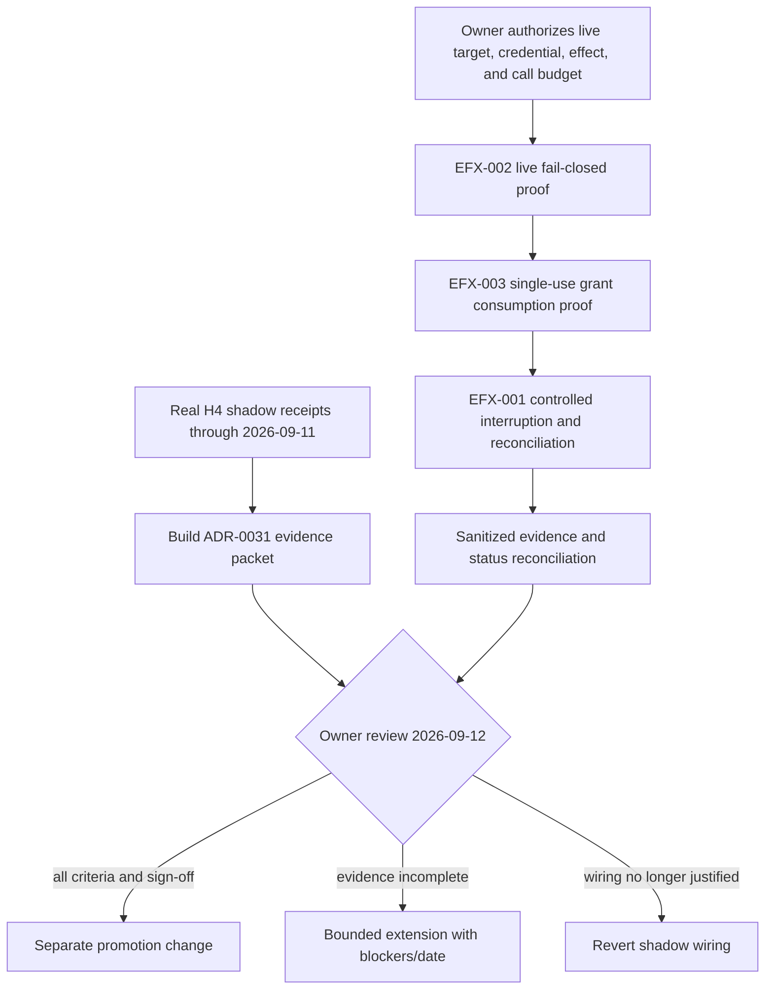

# Current Roadmap Execution Plan — 2026-08-26

> **Claim class:** Working execution plan for sequencing only. This document is
> not a roadmap-status or scheduling authority.
>
> **Authority:**
> [Harness-First Direction](../strategy/harness-first-direction-2026-06-13.md),
> [DR-006](../strategy/dr-006-owner-decision-2026-06-22.md),
> [Roadmap Status](../roadmap-status.md), and
> [Backlog Priority](../backlog-priority.md), in that order.
>
> **Status:** Active for already-authorized verification and dated decision
> preparation. Held rows remain held.
>
> **Owner:** Governance for preparation; owner-operator for live effects and
> Human Review decisions.
>
> **Last reviewed:** 2026-08-27 (Phase 2 evidence collected; see §6.1.1)
>
> **Review trigger:** EFX live-proof evidence lands; ADR-0031 is decided; a
> qualifying DR-006 signal is recorded; or an authority document changes.
>
> **Action register:** G-P0-2

## 1. Executive rule

Truth before features. H0–H6 are status taxonomy, not sprint order. This plan
sequences only work already admitted by DR-006 or required by a dated decision.
If this plan conflicts with an authority document, this plan loses.

Current execution order:

1. close the live-evidence gap for EFX-001 through EFX-003, but only after the
   owner explicitly authorizes the target, credential, effect, and call budget;
2. prepare the agent-completable ADR-0031 evidence before 2026-09-12, then let
   the owner choose promote, extend, or revert;
3. keep every other horizon and milestone trigger-only until its documented
   admission gate is met.

No work in this plan authorizes exactly-once claims, a generic effect ledger or
outbox, distributed fencing or leases, actor supervision, a second runner, live
provider use without owner authorization, cloud/SaaS expansion, or public
adoption work.

## 2. Phase 0 — Documentation discovery and allowed surfaces

Planning must copy the existing contracts below; do not invent parallel APIs.

| Purpose | Allowed existing surface | Source of contract |
| --- | --- | --- |
| Governed external-effect dispatch | `AgentRunner` through `teaagent agent run ... --permission-mode prompt` | `docs/USAGE.md` permission-mode matrix; `teaagent/runner/_core.py` |
| Exact pending-call continuation | `teaagent agent resume <provider> <run_id> --approve-scoped <tool>:<payload_sha256>` | `docs/USAGE.md`; `docs/recovery-and-continuity-guide.md` |
| Effect classification | `ToolAnnotations.external_effect` with local policy authoritative over remote hints | `teaagent/tools.py`; `teaagent/mcp_tool_adapter.py`; `tests/test_efx002_effect_classification.py` |
| Interrupted-dispatch disclosure | checkpointed `pending_effect`, `OUTCOME_UNKNOWN`, `retry_safe=false`, and refusal of blind non-idempotent redispatch | `teaagent/runner/_core.py`; `teaagent/integration/resume_preparation.py`; `tests/test_efx001_interrupted_dispatch.py` |
| One-time approval | payload-digest-bound grant consumed by `ApprovalManager.assert_allowed()` | `teaagent/approval/manager.py`; `tests/test_efx003_one_time_approval.py` |
| H4 denial-candidate extraction | `scripts/prepare_h4_evidence.py` / `build_h4_evidence_report()` | `docs/specs/rbac-shadow-to-enforce-promotion-spec-2026-07-11.md` §3.1 |
| H4 coverage inventory | `scripts/check_h4_coverage.py` / `build_h4_coverage_report()` | same spec §3.1 criterion 2 |
| H4 latency evidence | `scripts/benchmark_h4_policy.py` / `measure_policy_evaluation_performance()` | same spec §3.1 criterion 3 |
| H4 rollback evidence | `scripts/verify_h4_rollback.py` / `run_h4_rollback_dry_run()` | same spec §3.4 |
| H4 owner packet | `scripts/build_h4_decision_packet.py` / `build_h4_decision_packet()` | same spec §3.1; `teaagent/governance/h4_decision_packet.py` |

Anti-pattern guards:

- Do not call `ToolRegistry.execute()` directly for a production-side effect;
  route through the governed runner so approval policy executes first.
- Do not use `allow` or `danger-full-access` as EFX proof; those modes do not
  prove exact Prompt-mode escalation.
- Do not use `--approve-call-id`; it is inert. Use the raw canonical payload
  digest shown by the pending call.
- Do not let MCP `readOnlyHint` or `destructiveHint` relax local annotations.
- Do not commit tokens, raw audit logs, private browser state, or unredacted
  provider responses.
- Do not set or claim `promotion_ready=true` for ADR-0031. The current packet
  API always keeps Human Review explicit.

## 3. Current status and execution disposition

| Item | Priority / admission | Current proof | Blocking gate | Execution disposition |
| --- | --- | --- | --- | --- |
| EFX-001 | P0 `governance-gap`; Promote | runner effect sandwich, process-death fault test, providerless acceptance | authorized live target plus reconciliation receipt | Verify/close in Phase 1; run last because interruption has the highest external ambiguity |
| EFX-002 | P0 `governance-gap`; Promote | local `external_effect`, fail-closed Prompt/read-only/workspace-write, MCP hint isolation | authorized live GitHub/browser/provider proof | Verify/close first in Phase 1 |
| EFX-003 | P0 `governance-gap`; Promote | digest-bound consume-once JIT grant, providerless acceptance | authorized exact-call and replay proof at a live boundary | Verify/close second in Phase 1 |
| ADR-0031 / H4 policy-RBAC | `governance-gap`; Hold until review | evidence tooling and RBAC enforce path exist; policy enforce label remains advisory | 30-day receipts, coverage, latency, rollback, owner sign-off; review 2026-09-12 | Prepare evidence in Phase 2; no default flip before owner decision |
| H2 / H3 | Hold | M2/M3 foundation evidence complete | owner-validated continuity need or cited friction | No scheduled work |
| M4 background / cockpit | Hold except dogfood carve-out | dormant lifecycle and cockpit surfaces exist | dated co-maintainer dogfood record | Trigger-only; cloud/SaaS remains excluded |
| H5 / M5 | Blocked | offline fixture release gates exist | funded live-provider variance/cost evidence and owner decision | Trigger-only |
| H6 / M6 | Hold | local update proof exists; daily CLI intentionally absent | owner update friction and signed trust-boundary proof | Trigger-only |
| WDH-002 | Hold | simulated protocol only | consenting non-maintainer participant and privacy review | Human-trigger-only |
| EFX-FUTURE | Hold / absent | no provider settlement contract | EFX closure, dated owner promise, sink-enforced identity/status contract, fault evidence, Human Review | No design or implementation work |
| ADR-0029 consensus validation | Resolved | Option D delete/quarantine executed 2026-07-22; recovery record retained | new owner/governance decision required for any revival | No scheduled work; no 2026-12-10 decision remains |

## 4. Critical path



The H4 evidence lane may run in parallel with EFX preparation. H4 promotion may
not bypass either its own five criteria or the roadmap's EFX live-proof gate.

## 5. Phase 1 — Close EFX-001 through EFX-003

### Definition of ready

The owner records all of the following in the active session before any live
call:

- exact throwaway repository or browser/provider target;
- credential source and least privilege scope;
- allowed tool names, canonical payloads, and maximum call count;
- expected external effect and pre-run remote state;
- who will reconcile or reverse the effect if the runner outcome is unknown;
- authorization to perform the specific live mutation and, for EFX-001, the
  controlled interruption.
- at least one GitHub mutator and one browser mutator if the owner intends to
  close the broad EFX-002 claim; authorizing only one family yields scoped
  evidence and does not close the other;
- for EFX-001, an owner-reviewed temporary fault harness copied from
  `tests/test_efx001_interrupted_dispatch.py`; do not add a production
  fault-injection API.

Absent any one item, Phase 1 remains blocked without changing EFX status.

### 5.1 EFX-002 — classification and escalation

1. Start in `prompt`, `read-only`, or `workspace-write`; do not widen to
   `allow`/`danger-full-access`.
2. For broad closure, request one authorized GitHub mutation and one authorized
   browser mutation through `AgentRunner`. A narrower authorization proves only
   that named integration.
3. Before approval, prove the run returns `pending_approval`, records
   `tool_call_pending_approval`, and leaves the external target unchanged.
4. Confirm the pending record names the locally classified external-effect tool
   even if remote metadata claims read-only.
5. Approve only the exact payload digest and continue through the governed path.

Exit evidence:

- sanitized run ID, tool name, payload digest, approval/audit event IDs, and
  before/after external state;
- proof that the handler was not called before approval;
- no ambient credential warning left unexplained.

### 5.2 EFX-003 — exact one-time binding

1. Use the exact EFX-002 pending call; do not mint a wildcard or bare call-ID
   approval.
2. Prove the approved tool/payload executes once.
3. Attempt a second dispatch with the same grant and a dispatch with changed
   arguments; both must deny without a second external mutation.
4. Record the consumed grant and denial events.

Exit evidence:

- one successful external effect for one exact digest;
- two denied replays: same payload after consumption and changed payload;
- provider state showing no duplicate effect.

### 5.3 EFX-001 — interrupted dispatch and reconciliation

Run only after EFX-002 and EFX-003 pass, against a reversible throwaway effect.
Copy the existing spawned-run/process-exit pattern from
`tests/test_efx001_interrupted_dispatch.py` into a reviewed temporary harness;
replace only the local marker effect with the authorized real handler. Do not
create a permanent fault-injection or alternate-dispatch surface.

1. Capture remote pre-state and the exact non-idempotent payload.
2. Dispatch through the governed runner. The temporary handler must terminate
   the child after the provider mutation is externally observable but before
   the runner persists completion, reproducing the documented ambiguity.
3. Resume the run. It must surface `OUTCOME_UNKNOWN`, set `retry_safe=false`,
   and refuse blind redispatch of the same non-idempotent digest.
4. Inspect the provider independently and record whether the effect happened.
5. Reconcile explicitly. Do not label the harness outcome settled merely
   because the remote state is later discovered.

Exit evidence:

- checkpoint and audit receipt showing start without completion;
- resume receipt showing refusal of blind redispatch;
- remote-state reconciliation result and any separately authorized cleanup;
- no exactly-once, automatic settlement, or automatic reversal claim.

### 5.4 Closure and status transition

Create a sanitized dated work-log only after all three live proofs exist. It
must include target class, run IDs, event IDs, redacted payload digests, remote
receipts/URLs, call budget, reconciliation outcome, operator, and residual
risks. Raw audit logs remain in the governed run store, not `docs/`.

Then, in one status-reconciliation change:

- update EFX-001..003 in `docs/roadmap-status.md` and
  `docs/backlog-priority.md` from In Progress only if each exit contract passed;
- update the daily-driver warning with the exact live-proof scope; do not imply
  all providers are proven from one target;
- retain EFX-FUTURE as held;
- update `docs/acceptance.md` only with reproducible test evidence, not a manual
  live-call count;
- run the EFX focused suite, acceptance tier, docs consistency, and docs gates.

## 6. Phase 2 — Prepare and decide ADR-0031

### 6.1 Collect real evidence through 2026-09-11

Use real shadow receipts; agents may extract candidates but may not invent runs
or owner verdicts. Store raw outputs under `.teaagent/reviews/adr-0031/`, which
is local runtime evidence rather than committed documentation.

For the 30-day window ending the day before review:

```bash
python3 scripts/prepare_h4_evidence.py \
  --audit-log "$AUDIT_LOG" \
  --since 2026-08-13 \
  --until 2026-09-11 \
  --output .teaagent/reviews/adr-0031/shadow-evidence.json

python3 scripts/check_h4_coverage.py \
  --output .teaagent/reviews/adr-0031/coverage.json

python3 scripts/benchmark_h4_policy.py \
  --policy-count 25 \
  --iterations 100 \
  --threshold-ms 50 \
  --output .teaagent/reviews/adr-0031/performance.json

python3 scripts/verify_h4_rollback.py \
  --output .teaagent/reviews/adr-0031/rollback.json

python3 scripts/build_h4_decision_packet.py \
  --audit-log "$AUDIT_LOG" \
  --since 2026-08-13 \
  --until 2026-09-11 \
  --output .teaagent/reviews/adr-0031/decision-packet.json
```

The owner must adjudicate every denial candidate. A missing week, no real runs,
an unknown verdict, malformed receipt, coverage gap, median latency at or above
50 ms, or failed rollback keeps the corresponding criterion unsatisfied.

### 6.1.1 Evidence collected 2026-08-27

Agent-completable evidence scripts were run on 2026-08-27 at commit
`ecf8ec5`. Results stored under `.teaagent/reviews/adr-0031/`:

| Criterion | Script | Result | Status |
| --- | --- | --- | --- |
| 1 — shadow window | `prepare_h4_evidence.py` | 0 observed events, 0 denial candidates | Open — no `h4_governance_shadow` events in 1391 audit logs; shadow mode has not been exercised |
| 2 — coverage | `check_h4_coverage.py` | 0 policies, 0 roles, 0 gaps | Pass |
| 3 — performance | `benchmark_h4_policy.py` | median 0.50 ms, max 0.59 ms (threshold 50 ms) | Pass |
| 4 — human sign-off | — | owner/security-governance sign-off required | Human-required |
| 5 — rollback | `verify_h4_rollback.py` | `ok=true` | Pass |

Aggregate packet (`build_h4_decision_packet.py`): 4 agent-prepared
criteria, 1 human-required, `promotion_ready=false`.

Criterion 1 having zero observations is honest evidence: the shadow
wiring exists but has not been triggered in real runs. The owner must
decide whether zero observations satisfies "30-day zero-false-positive
window" or whether exercised shadow receipts are required before
promotion. This plan takes no position on that adjudication.

### 6.2 Owner decision on 2026-09-12

Choose exactly one outcome and record it in ADR-0031 plus a dated decision log:

1. **Promote:** all five criteria pass and the owner signs off. Create a separate
   high-risk implementation plan. Promote RBAC first, policy second; each
   surface remains independently reversible. The policy path requires real
   deny behavior because its current `enforce` label is advisory-only.
2. **Extend:** name each missing criterion, why more observation is justified,
   the new expiry date, and the evidence to collect. Never silently roll the
   date forward.
3. **Revert:** remove shadow wiring that lacks justified demand while preserving
   the evidence and decision history.

No agent-generated packet can satisfy Human Review. No mode/default change may
share a commit with an undecided or incomplete packet.

## 7. Phase 3 — Trigger-only roadmap plans

Do not pre-build these lanes. When a trigger occurs, create one bounded plan
that cites the exact signal and copies its existing companion spec.

| Lane | Trigger required before planning implementation | Existing contract to copy |
| --- | --- | --- |
| H2 continuity | owner-validated IDE/dashboard/background continuity need | current Roadmap H2 exit evidence; no cloud parity assumption |
| H3 ecosystem trust | friction-log entry for a real onboarding/revocation failure | completed DSK acceptance spine plus the observed failure |
| M4 background/cockpit | dated co-maintainer dogfood session | `background-lifecycle-acceptance-spec-2026-07-11.md` or `operator-cockpit-acceptance-spec-2026-07-11.md` |
| H5/M5 eval | funded live-provider program and owner decision | `nonadvisory-eval-gate-promotion-spec-2026-07-11.md` |
| H6/M6 packaging | owner update friction plus signed-artifact trust boundary | `update-cli-wiring-and-packaging-spec-2026-07-11.md` |
| WDH-002 | consenting non-maintainer and privacy preflight | `wdh-002-external-pilot-protocol-2026-07-11.md` |
| EFX-FUTURE | dated owner promise plus a provider-specific identity/status/reconciliation contract and fault evidence | ADR-0042 boundary first; no generic subsystem template |
| Dormant-surface deletion review | owner names a dormant surface with cited friction or maintenance cost | ADR-0029 Option D disposition spec (import-graph scan proving zero active callers, git recovery anchor, atomic deletion of code/shims/tests, consistency guard) |

Monitoring CP-4, holding CP-6, or refreshing a survey does not satisfy a code
admission gate. An empty scheduled queue is an acceptable result.

## 8. Verification and definition of done

### Plan verification

- [ ] `docs/roadmap-status.md` and `docs/backlog-priority.md` remain the only
      owners of status and scheduling.
- [ ] ADR-0029 has no stale 2026-12-10 active decision in the held-roadmap
      queue; Option D execution remains recoverable.
- [ ] EFX-001..003 remain In Progress until live proof actually lands.
- [ ] EFX-FUTURE, M4 cloud/SaaS, H5/M5, H6/M6, and WDH-002 remain held or
      blocked without their trigger.
- [ ] ADR-0031 preparation never flips enforcement or claims Human Review.

### Repository checks after plan/status edits

```bash
python3 -m pytest tests/test_docs_consistency.py \
  tests/acceptance/test_docs_acceptance_count_accuracy.py -q
python3 scripts/validate_docs_consistency.py
./scripts/verify_docs.sh
```

### Done

This plan is complete when it is indexed from the documentation front door,
the stale ADR-0029 queue is reconciled, and the checks above pass. Execution of
Phase 1 and the ADR-0031 owner decision are separate gated outcomes; this plan
does not fabricate their completion.

## 9. Related documents

| Document | Role |
| --- | --- |
| [Roadmap Status](../roadmap-status.md) | canonical implementation/horizon state |
| [Backlog Priority](../backlog-priority.md) | canonical scheduling disposition and provenance |
| [Daily-Driver Current Status](../daily-driver-current-status.md) | operator-facing runtime trust and caveats |
| [Held Roadmap Forward-Spec Index](../specs/held-roadmap-forward-spec-index-2026-07-11.md) | trigger contracts for held lanes |
| [ADR-0031](../adr/0031-shadow-mode-exit-criteria.md) | shadow-to-enforce decision and expiry |
| [H4 Promotion Spec](../specs/rbac-shadow-to-enforce-promotion-spec-2026-07-11.md) | evidence procedures and promotion mechanics |
| [ADR-0042](../adr/0042-shell-mutation-reversibility-boundary.md) | reversal and external-effect boundary |
| [Durable-Effect Review](../analysis/durable-effect-roadmap-socratic-review-2026-08-25.md) | EFX adoption reasoning and non-goals |
