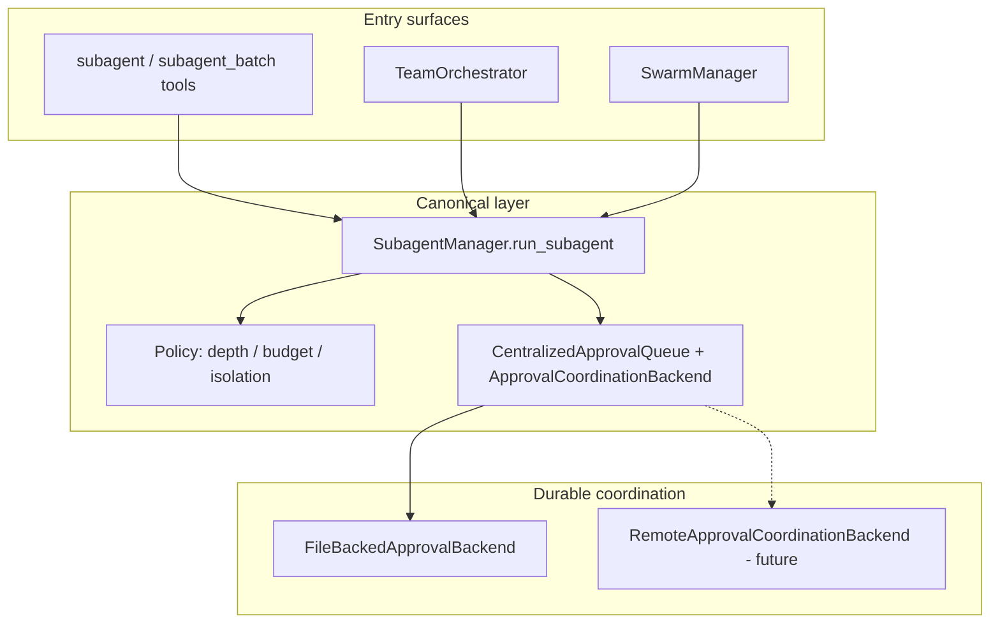

# Subagent and Swarm Orchestration Unification (WS2-006)

> **Status:** Design accepted for Phase 0/1 local execution.
> **Date:** 2026-06-06
> **Related:** WS2-001–005, ADR 0022, `docs/strategy/remote-multi-agent-non-goals-2026-06-06.md`

## Problem

TeaAgent currently exposes three overlapping orchestration surfaces:

| Surface | Module | Primary use |
| --- | --- | --- |
| **Subagent tools** | `teaagent/subagents/_tools.py`, `_manager.py` | Model-invoked `subagent`, `subagent_batch`, named defs |
| **Team orchestrator** | `teaagent/subagents/_team_orchestrator.py` | YAML team defs, lead + specialists merge |
| **Swarm manager** | `teaagent/swarm.py` | Tournament/consensus, git-branch sandboxes, control-plane publish |

These layers share concepts (parent run, batch index, isolation, approvals) but differ in entry points, cost rollup, and approval wiring. Remote multi-agent work is blocked until one canonical execution path owns budget, depth, isolation, and durable approvals.

## Decision

**Canonical execution engine:** `SubagentManager` (`teaagent/subagents/_manager.py`).

All child agent runs—whether launched from a tool call, a team orchestrator, or a swarm tournament—must flow through `SubagentManager.run_subagent()` so WS2-001–004 policies apply uniformly:

- Isolation default (`resolve_subagent_isolation`)
- Budget caps (iterations, tool calls)
- Global depth guard
- Centralized approval queue via durable backend (WS2-005)

**Canonical schedulers (thin wrappers):**

| Scheduler | Role | Must delegate to |
| --- | --- | --- |
| `TeamOrchestrator` | Task fan-out + merge strategy | `SubagentManager` (already does) |
| `SwarmManager` | Parallel tournament / consensus / branch isolation | `SubagentManager` when real agent work runs (`SwarmManager.with_agent_execution`) |

**Non-canonical paths (compatibility only):**

- `SwarmManager` mock execution when no `SubagentManager` is bound (tests, lightweight demos)
- Direct `Subagent` git-branch sandbox runs that bypass `run_subagent` — deprecated; keep until migration tests pass

## Target architecture



## Compatibility path (Phase 0/1)

1. **Keep existing public APIs** — `subagent_batch`, `SwarmManager.run_tournament`, `TeamOrchestrator.run_team` remain stable.
2. **Require `SubagentManager` for production swarm runs** — document `SwarmManager.with_agent_execution()` as the supported constructor; mock path is test-only.
3. **Unify approval context** — swarm and team launches set `parent_run_id`, `batch_index`, and `workspace_root` before calling `run_subagent` so centralized approvals always persist via `ApprovalCoordinationBackend`.
4. **Shared cost rollup hook** — schedulers read child run summaries from audit/run records keyed by `parent_run_id` (existing run JSONL); no second cost ledger in `SwarmManager`.
5. **Control plane** — `SwarmManager._publish_control_plane` stays swarm-specific; execution still goes through `SubagentManager`.

## Migration tests (acceptance checklist)

These tests must pass (or be added) before declaring orchestration unified:

| Test file | Proves |
| --- | --- |
| `tests/test_subagent_isolation_policy.py` | Isolation + depth + budget on tool path |
| `tests/test_subagent_batch.py` | Batch timeout + ordering on tool path |
| `tests/test_subagent_approval_queue_integration.py` | Centralized approval handler wiring |
| `tests/test_approval_queue_persistence.py` | Cross-process approve + recovery |
| `tests/test_approval_coordination_backend.py` | Durable backend abstraction + reload |
| `tests/test_subagent_team_orchestrator.py` | Team fan-out uses `SubagentManager` |
| `tests/test_swarm_agent_execution.py` | Swarm delegates to `SubagentManager` |
| `tests/acceptance/test_consensus_flow.py` | Swarm + consensus end-to-end |
| `tests/acceptance/test_subagent_lineage_flow.py` | Lineage metadata on CLI subagent path |

**Gap to close (future ticket):** assert swarm tournament children inherit WS2-003 budget caps when launched via `with_agent_execution` (add targeted test in `tests/test_swarm_agent_execution.py`).

## Out of scope (Phase 0/1)

Per `docs/strategy/remote-multi-agent-non-goals-2026-06-06.md`:

- Remote approval orchestration over HTTP (backend stub exists; implementation deferred)
- Multi-machine swarm scheduling
- Shared approval queues across tenants without workspace scoping

## Implementation sequence

1. ✅ WS2-001–004 — policy in `SubagentManager` / `_isolation.py`
2. ✅ WS2-005 — `ApprovalCoordinationBackend` + file default
3. ✅ WS2-006 — this document
4. **Next:** WS2-005 remote HTTP backend OR WS3 audit/compliance items

## Verification

```bash
python3 -m pytest \
  tests/test_approval_coordination_backend.py \
  tests/test_approval_queue_persistence.py \
  tests/test_subagent_approval_queue_integration.py \
  tests/test_subagent_team_orchestrator.py \
  tests/test_swarm_agent_execution.py \
  tests/acceptance/test_consensus_flow.py \
  -q
```
