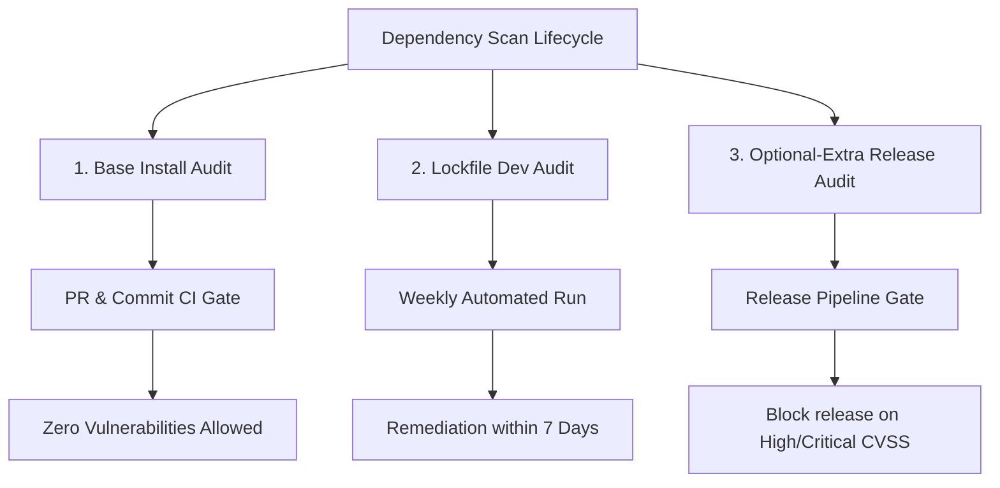

# Dependency Audit Policy

This document defines the security auditing policy for TeaAgent dependencies, specifically distinguishing between base, lockfile, and optional-extra dependency groups.

## Context

TeaAgent maintains a zero forced runtime dependency posture (`project.dependencies = []`). However, it supports various optional extras (e.g. `teaagent[file-watching]`, `teaagent[tui]`, `teaagent[managed-google-adk]`) which pull in transitive dependency trees. 

An un-segmented security scan of the entire package + all dev and optional dependencies can flag vulnerabilities in heavy transitive trees (like those pulled by `google-adk` or `playwright`) that are not loaded or used by base production users. Conversely, ignoring optional dependency trees entirely exposes users who opt-in to those features.

---

## Auditing Policy and Cadence

To resolve this Strategic Tension, dependency auditing is split into three distinct security lanes:

### 1. Base Install Audit (CI Gate)
*   **Scope:** The core package and the minimal imports required to initialize the harness.
*   **Cadence:** Evaluated on every Commit and Pull Request in the primary CI pipeline.
*   **Tooling:** `pip-audit` executed against the base installation (without extras).
*   **Threshold:** Strict zero-vulnerability gate. Any vulnerability (regardless of CVSS score) blocks build completion and merging.

### 2. Lockfile and Dev Environment Audit (Weekly Cadence)
*   **Scope:** Fully resolved development dependency lockfiles (including `ruff`, `mypy`, `pytest`, etc.).
*   **Cadence:** Automated weekly scheduled runs (e.g. via Dependabot and GitHub Actions).
*   **Tooling:** `pip-audit` scanning the fully locked environment.
*   **Remediation:** Any vulnerability flagged must be resolved by updating lockfiles/constraints within 7 days of detection.

### 3. Optional-Extra Runtime Audit (Release Gate)
*   **Scope:** Optional dependency extra groups (specifically `managed-google-adk`, `wasm`, `playwright`, `oauth`, and `telemetry`).
*   **Cadence:** Part of the pre-release checklist and release build pipelines. Must be executed before tagging any release.
*   **Tooling:** Scans isolating each extra group's dependency trees.
*   **Threshold:** High-Risk Gate. Any vulnerability in an optional-extra tree with a CVSS score of 7.0 or higher (High / Critical) blocks release packaging. Vulnerabilities below 7.0 must be documented in the release notes with mitigation paths (e.g. sandboxing constraints).
