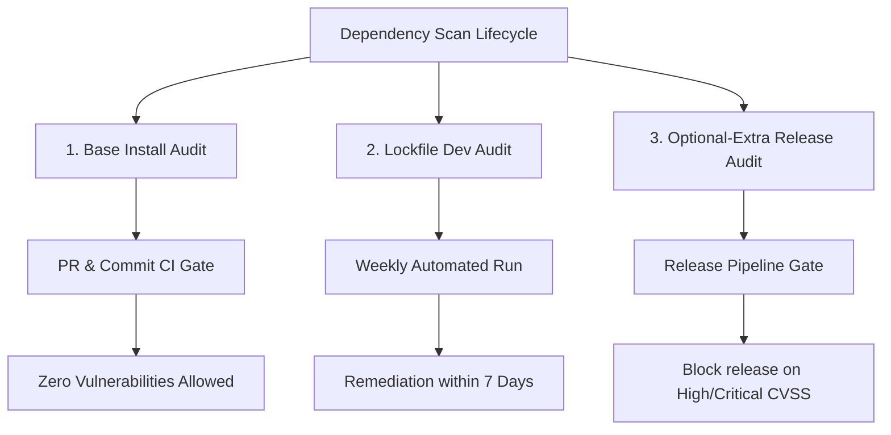

# Dependency Audit Policy

This document defines the security auditing policy for TeaAgent dependencies.
It specifically separates base install, lockfile/dev, and optional-extra
dependency groups so that the zero-dependency core claim stays true without
ignoring users who opt into heavier runtimes.

## Context

TeaAgent maintains a zero forced runtime dependency posture
(`project.dependencies = []`). However, it supports optional extras such as
`teaagent[file-watching]`, `teaagent[tui]`, `teaagent[managed-google-adk]`,
`teaagent[managed-vertex]`, `teaagent[playwright]`, `teaagent[telemetry]`,
`teaagent[oauth]`, and `teaagent[wasm]`.

An unsegmented scan of the entire package plus all dev and optional
dependencies can flag vulnerabilities in heavy transitive trees, such as
`google-adk` pulling `fastapi` / `starlette`, that are not loaded or used by
base users. Conversely, ignoring optional trees entirely exposes users who opt
into those features.

The policy is therefore segmented, not permissive. Base users get a strict base
gate. Optional-extra users get explicit risk visibility and release gates.

---

## Auditing Policy and Cadence

Dependency auditing is split into three distinct security lanes:



### 1. Base Install Audit (CI Gate)

- **Scope:** The core package dependency surface without dev dependencies,
  optional extras, or the editable project package.
- **Cadence:** Every push and pull request in the security workflow.
- **Tooling:** `uv export --format requirements-txt --no-dev --no-emit-project
  --frozen`, then `pip-audit -r` against that exported requirement file.
- **Threshold:** Strict zero-vulnerability gate. Any vulnerability blocks the
  PR because it affects the default install surface.
- **Important rule:** Do not use unscoped `pip-audit --skip-editable` on the
  runner environment. It can audit packages that are present in the CI image or
  audit tool environment but are not TeaAgent base dependencies.

Canonical command shape:

```bash
uv export --format requirements-txt --no-dev --no-emit-project --frozen -o /tmp/teaagent-base-requirements.txt
pip-audit -r /tmp/teaagent-base-requirements.txt
```

### 2. Lockfile and Dev Environment Audit (Weekly Cadence)

- **Scope:** Fully resolved development and lockfile dependencies, including
  test, lint, typecheck, release, and broad development extras.
- **Cadence:** Weekly scheduled security workflow.
- **Tooling:** `uv export --format requirements-txt --no-emit-project --frozen`,
  then `pip-audit -r`.
- **Remediation:** Any vulnerability flagged must be resolved by updating
  lockfiles, constraints, or optional-extra policy within seven days of
  detection, or recorded as accepted risk with owner and date.
- **Interpretation:** A dev/lockfile CVE is real maintenance work, but it does
  not automatically prove that the base package is unsafe.

Canonical command shape:

```bash
uv export --format requirements-txt --no-emit-project --frozen -o /tmp/teaagent-dev-requirements.txt
pip-audit -r /tmp/teaagent-dev-requirements.txt
```

### 3. Optional-Extra Runtime Audit (Release Gate)

- **Scope:** Optional dependency extra groups, especially
  `managed-google-adk`, `managed-vertex`, `playwright`, `telemetry`, `oauth`,
  and `wasm`.
- **Cadence:** Weekly visibility run and mandatory pre-release review.
- **Tooling:** Matrix scans that isolate each extra group's dependency tree with
  `uv export --extra <extra> --no-dev --no-emit-project --frozen`, then
  `pip-audit -r`.
- **PR behavior:** Non-blocking outside release, because optional-extra
  vulnerabilities should not make the zero-dependency base package appear
  broken.
- **Release behavior:** High or Critical vulnerabilities in an optional-extra
  tree block release packaging for artifacts that advertise that extra.
  Lower-severity vulnerabilities must be documented in the release notes with
  mitigation, owner, and expected refresh date.

Canonical command shape:

```bash
uv export --format requirements-txt --extra managed-google-adk --no-dev --no-emit-project --frozen -o /tmp/teaagent-managed-google-adk-requirements.txt
pip-audit -r /tmp/teaagent-managed-google-adk-requirements.txt
```

## CI Mapping

| Lane | Workflow behavior | Blocking scope |
| --- | --- | --- |
| Base install audit | Runs on push, pull request, schedule, and manual dispatch. | Blocking for all PRs and commits. |
| Lockfile/dev audit | Runs in the same workflow on the weekly schedule. | Blocking for scheduled maintenance; triaged within seven days. |
| Optional-extra runtime audit | Runs as `optional-extra-pip-audit` on schedule and manual dispatch with `continue-on-error: true`. | Non-blocking outside release; release gate for advertised extras. |

## Known 2026-06-04 Interpretation

The current lockfile contains optional `google-adk` transitive dependencies that
include `fastapi` and `starlette`. A `starlette` advisory in that tree is an
optional-extra finding unless the base export also contains it. It should not
cause the base PR gate to fail, but it must remain visible for release and
managed-runtime users.
