# Background Full-Lifecycle Acceptance Spec (M4 carve-out, BG-001)

> **Claim class:** Forward-looking specification (planned/held work — NOT current truth).
>
> **Status:** Allowed under DR-006 carve-out (owner-override: co-maintainer dogfood).
>
> **Date:** 2026-07-11
>
> **Trigger:** Owner request 2026-07-11 — forward-spec held/external roadmap items
> so future execution has pinned contracts and executable holds.
>
> **Scheduling gate (DR-006):** `owner-override` — M4 "background lifecycle +
> operator cockpit may proceed under owner-override co-maintainer dogfood"
> (`docs/strategy/dr-006-owner-decision-2026-06-22.md`). Gateway task intake
> and cloud/SaaS remain **Held**; one-line non-goal here.
>
> **Owns:** The BG-001 "background full lifecycle acceptance" definition:
> current state machine (verified), the target lifecycle contract, and its
> executable specification.
>
> **Does not own:** Current-truth status (`docs/roadmap-status.md`), the M4
> hold, suspend/resume design history (TICKET-16, closed).
>
> **Review trigger:** M4 gate evaluation, or a change to
> `BackgroundRunRecord` / the background CLI surface.

## 1. Current verified state (2026-07-11, HEAD)

Implementation: `teaagent/ergonomics/background_run.py`.

- **Record:** frozen dataclass `BackgroundRunRecord`
  `{background_id, pid, command, started_at, log_path, run_id?, label?,
  stopped_at?, exit_code?}` (`:47-60`), persisted as JSON under
  `.teaagent/background/` (tenant-scoped, `:78-83`).
- **Operations:** `start` (detached `subprocess.Popen`, uuid4-hex id,
  per-run log file; refuses empty command `:95-96`, refuses readonly
  `:91-94`); `get` (refreshes process state, backfills `run_id` by parsing
  the child's log, `:122-134`); `update_run_id`; `list` (mtime-sorted,
  liveness-enriched `:148-165`); `logs` (bounded tail, `:167-183`); `stop`
  (SIGTERM, bounded wait, SIGKILL escalation; records
  `stopped_at`/`stop_signal`/`alive=false`, `:185-211`).
- **Liveness overlay:** `_enrich_liveness` joins
  `run_liveness.liveness_snapshot` → `liveness_updated_at`,
  `liveness_age_seconds`, `liveness_stale` (`:214-226`).
- **Run-level truth:** the child process is a normal `teaagent agent run`;
  its authoritative outcome lives in the child's own RunStore/audit stream
  (`run_started` … `run_completed|run_failed` — ADR-0032 M0 taxonomy,
  `teaagent/runner/_events.py:42-49`). There are **no background-specific
  event types** in `RunEventType` today (planned list `:86-89` does not
  include them).
- **Terminal-state fidelity limitation (load-bearing):** `_refresh_process_state`
  reaps a child owned by the current process and records its real exit code
  (`background_run.py:332-359`). If another waiter already reaped it,
  `ChildProcessError` leads to a derived `alive` probe and the code defaults a
  missing exit code to `0` (`:343-366`). Across processes, that fallback can
  misclassify a failed child as successful. Completed-vs-failed must therefore
  be reconciled with the child's audit events via `run_id`; `alive=false` or a
  fallback `exit_code=0` alone is not authoritative.
- CLI/UX: background submit path rejects reusing known run/suspension ids
  (DS-09, `test_agent_run_background_rejects_known_run_or_suspension_id`);
  attach/notify flow covered by
  `tests/acceptance/test_background_attach_resume_notify_flow.py`;
  cockpit BACKGROUND tab consumes these records
  (`teaagent/tui/cockpit_data_sources.py` BackgroundDataSource).

### Current state machine (verified against code)

```mermaid
stateDiagram-v2
    [*] --> submitted: start() writes record + Popen
    submitted --> running: process alive
    running --> exited: process ends (real code if reaped locally; fallback may be 0)
    running --> stopped: stop() SIGTERM→SIGKILL, stop_signal recorded
    exited --> [*]
    stopped --> [*]
    note right of running
        run-level truth (completed/failed)
        comes from the child's audit stream
        via run_id, not from the process
    end note
```

Suspend/resume is a **run-level** mechanism (RunStore suspensions,
TICKET-16), orthogonal to the background **process** records above; a
suspended child leaves a resumable run behind while the background record
simply reports the process as no longer alive.

## 2. The hold and its gate

Only background lifecycle + operator cockpit are carved out of the M4 hold
(DR-006). Gateway task intake, cloud submit surfaces, and multi-tenant
operation are **not** in scope and stay Held. This spec schedules nothing;
it defines what "BG-001 background full lifecycle acceptance" will mean
when the owner runs the dogfood session.

## 3. Future contract (BG-001 acceptance definition)

1. **Submit → observe → outcome, one identity chain.** From
   `background_id` alone the operator can reach: the pid (process state),
   the log tail, the `run_id`, and from it the run receipt with outcome.
   The record's `run_id` backfill (`get`/`list`) is the join point and must
   survive process death.
2. **Terminal-state honesty.** Surfaces must render three distinct facts,
   never conflated: process liveness (`alive`), run outcome (from audit:
   completed/failed/pending_approval/cancelled), and liveness staleness
   (`liveness_stale`). "Process dead + no run outcome + stale liveness" =
   orphan candidate, surfaced as such.
3. **Orphan detection on restart (new behavior).** A `list` performed after
   a machine restart marks records whose pid is dead and whose run has no
   terminal audit event as `orphaned` (derived, not stored), so the cockpit
   BACKGROUND tab can offer resume (when a suspension exists) or cleanup.
4. **At-most-once side effects.** Background runs carry the same approval
   scoping as foreground (`build_agent_run_command` preserves governance
   flags — proven by
   `tests/acceptance/test_automation_foreground_parity_flow.py`); a
   resumed run must not silently re-execute approved destructive calls —
   re-approval semantics follow the existing scoped-approval digests.
5. **Background lifecycle audit events (new taxonomy members).** Add to
   `RunEventType`: `BACKGROUND_SUBMITTED`, `BACKGROUND_STOPPED` with
   payloads `{background_id, pid, command_digest, label?}` /
   `{background_id, stop_signal, stopped_at}` — emitted by the parent
   (submitter/stopper), consumed by audit like all spine events. Today
   these transitions exist only as JSON record fields, invisible to the
   audit chain.
6. **Stop is safe and idempotent.** `stop` on an already-dead process
   records the stop without raising; repeated `stop` calls converge on the
   same terminal record.

## 4. Executable specification

Tests live in `tests/lifecycle/test_background_lifecycle_spec.py`.

| Contract clause | Test | Kind |
| --- | --- | --- |
| Record schema is the cross-surface protocol base | `test_background_record_schema_is_pinned` | guards contract today — cockpit rows, attach flow, and this spec parse these keys |
| Empty command refused at submit | `test_start_refuses_empty_command` | guards contract today |
| Lifecycle round-trip: submit → exit → observe → safe stop | `test_lifecycle_roundtrip_exit_then_safe_stop` | guards contract today (§3.6 safety half) |
| Background taxonomy members | `test_background_event_taxonomy_activates` | activates on implementation (skipif until §3.5 members exist) |

Existing coverage (not duplicated): start/list/get/missing/readonly,
dead-pid reconciliation, run_id log backfill, liveness enrichment
(`tests/test_background_run.py`, `tests/test_background_unified.py`,
`tests/test_run_liveness.py`), attach/notify acceptance, budget caps,
foreground governance parity (acceptance flows cited in §1).

## 5. BG-001 acceptance checklist

1. Implement §3.3 orphan derivation + §3.5 taxonomy members (+ emit sites)
   and activate the taxonomy test.
2. Dogfood session (owner + one co-maintainer agent): submit a background
   run, watch it in the cockpit, let it complete; submit another, stop it;
   kill a third's process manually and verify the orphan surfacing. Record
   as a dated work-log note.
3. Walk §3.1-3.6 against the session's artifacts; every fact must come
   from `teaagent` surfaces (CLI/TUI/cockpit), not from `ps` or raw JSON.
4. Update `docs/roadmap-status.md` M4 background sub-criterion citing the
   note; docs regen chain + validators green.

## 6. Risks and open questions

- **Exit-code fallback risk** (§1 limitation): local reconciliation can reap
  the real code, but cross-process reconciliation may substitute `0` after
  another waiter reaped the child. The contract routes around that uncertainty
  via audit truth. Do not add a second supervisor solely to recover exit codes
  without owner friction; first make the fallback explicit in operator output.
- **Suspension-id collisions** are already rejected at submit (DS-09);
  §3.3 orphan handling must not resurrect that class by auto-resuming.
- **Double-stop / stop-vs-exit race:** §3.6 requires convergence, not
  precedence; the record's `stop_signal` may name SIGTERM even when the
  process exited on its own microseconds earlier. Accepted inaccuracy,
  documented.
- Open: should `BACKGROUND_SUBMITTED` carry the full command? Default: a
  digest only (commands can embed paths/secrets; the log already has the
  full line under workspace permissions).
