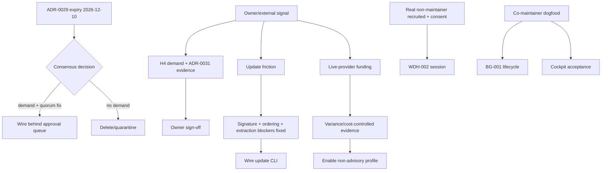

# Held Roadmap Forward-Spec Index — 2026-07-11

> **Claim class:** Forward-looking coordination index (planned/held work — NOT
> current truth).
>
> **Status:** Preparation and traceability artifact. It does not promote any
> roadmap item.
>
> **Date:** 2026-07-11
>
> **Trigger:** Owner request 2026-07-11 — reason over TeaAgent's roadmaps and
> plans, document future contracts deeply, and write executable specifications
> even where implementation is intentionally absent.
>
> **Scheduling gates:** DR-006 dual-track scheduling (`friction-driven`,
> `governance-gap`, `owner-override`) plus external/human dependencies.
>
> **Owns:** Navigation, authority ordering, cross-spec contracts, inference
> ledger, promotion graph, and aggregate test map for the seven companion specs.
>
> **Does not own:** Current statuses (`docs/roadmap-status.md`), release claims,
> owner decisions, ADR acceptance, or implementation scheduling.
>
> **Review trigger:** A companion spec changes status, EFX-FUTURE gains an
> owner-ratified promise, ADR-0031 reaches expiry, or harness-first direction changes.

## 1. Why this packet exists

The verified 2026-07-01 roadmap result is unusual: **every code-bearing roadmap
unit was complete, while the remaining apparent work was held, external,
human-reviewed, or dependent on live providers**
(`docs/work-log/roadmap-verification-2026-07-01.md:10-18,62-72,85-90`).
Generating more implementation would therefore be false progress. The useful
engineering action is to make each boundary explicit:

1. pin what exists now with behavioral tests;
2. pin what must remain absent while a hold applies;
3. specify the interface and evidence required to end the hold;
4. add skipped activation tests only where no implementation surface exists;
5. expose dormant quirks that become blockers if a surface is wired later.

This packet follows harness-first's thin-harness invariant: it does not add a
second framework, supervisor, workflow engine, or product surface. It adds
contracts around already-existing systems and the decisions that govern them.

**2026-08-25 exception:** The later
[durable-effect roadmap review](../analysis/durable-effect-roadmap-socratic-review-2026-08-25.md)
reproduced three local effect-authority gaps. EFX-001–003 now live in the
canonical roadmap/backlog as direct DR-006 governance remediation. This index
holds only the broader, still-unearned external-effect architecture.

## 2. Authority order (resolve conflicts top-down)

| Priority | Authority | What it decides |
| ---: | --- | --- |
| 1 | `docs/strategy/harness-first-direction-2026-06-13.md` | Product identity: owner-operated, harness-first; external adoption descoped; agents cannot simulate owner evidence. |
| 2 | `docs/strategy/dr-006-owner-decision-2026-06-22.md` | Scheduling gates; M4 background/cockpit carve-out; cloud/SaaS hold; split release gate. |
| 3 | `docs/roadmap-status.md` | Canonical current horizon/milestone/track status. |
| 4 | `docs/backlog-priority.md` | Provenance tags and hold/promote decisions. |
| 5 | ADRs (`0031`, `0029`, `0032`) | Surface-specific decisions, expiry dates, event contract. |
| 6 | This index + companion specs | Future acceptance contracts only. |
| 7 | Dated analysis/history | Evidence and prior reasoning; never current-truth authority. |

If a companion spec sounds more current than the roadmap, the spec is wrong.
If a historical plan schedules work DR-006 holds, DR-006 wins.

## 3. Remaining-roadmap classification

### 3.1 Honest current partition

| Area | Verified current state | Why it remains open/partial | Gate | Packet action |
| --- | --- | --- | --- | --- |
| H2 multi-surface continuity | M2 foundation complete | IDE/dashboard/cloud parity is external/future | harness-first descope | No implementation spec added; existing parity docs/tests remain sufficient. |
| H3 ecosystem trust | M3 + three-concept onboarding complete | Further simplification needs real daily-use signal | `friction-driven` | No speculative UX work; cockpit spec preserves current operator answers. |
| H4 policy/RBAC | RBAC enforce path exists; shipped default shadow; policy "enforce" label is advisory-only | Owner-demand hold + ADR-0031 evidence window | `governance-gap`, expiry 2026-09-12 (decision packet review) | Promotion spec + 7 adversarial checks. |
| H4 consensus validation | 658-line module is experimental/unwired; CLI uses another consensus engine | ADR-0029 deliberately avoids a third consensus gate | expiry decision 2026-12-10 | Wire-or-delete disposition + import-graph guard + 5 behavioral pins. |
| H4 effect correctness boundary | EFX-001–003 local dispatch/approval gaps are reproduced and promoted on current-truth surfaces; ADR-0042 still bounds external reversal | Local fixes do not establish exactly-once, provider settlement, business acceptance, reconciliation, or distributed safety | `owner-override` plus provider-specific evidence | Keep EFX-FUTURE held; reuse existing governed seams; create no generic effect subsystem or companion-spec stack. |
| M4 background lifecycle | Detached process store, attach, liveness, cockpit rows exist | Orphan semantics and background transition events are not pinned as acceptance | DR-006 carve-out (`owner-override`) | BG-001 acceptance spec + 3 checks + activation skip. |
| M4 operator cockpit | CLI shared snapshot + TUI tabs/data sources exist | Needs owner dogfood proof against M4 exit question | DR-006 carve-out (`owner-override`) | Acceptance matrix + v1 schema pins. |
| M4 gateway/cloud/SaaS | Some dormant surfaces may exist | Explicitly held; external/multi-tenant GTM is a non-goal | `legacy-competitive` hold | Deliberately not specified beyond the hold boundary. |
| H5/M5 eval gate | Corpus gate blocks CI; simulated execution is disclosed advisory-only; fixture corpus is real | Live provider evidence, cost/variance policy, owner decision absent | `governance-gap` + live dependency | Non-advisory promotion spec + 6 checks + activation skip. |
| H6/M6 update/packaging | Update/delta/installer/changelog modules + local update/rollback proof exist; no CLI | Owner has no update friction; trust boundary incomplete; desktop packaging future | `friction-driven` | CLI/trust spec + absence guard + 3 dormant blocker pins. |
| WDH-002 | Simulation harness + three simulated records | Real non-maintainer consent/testimony cannot be generated by agents | external human dependency | Human-ready protocol + 4 truth/schema checks + activation skip. |
| TASK-001 constitution positioning | Harness-first text decision ratified | Public positioning changes require Human Review | `owner-override`, Human Review | Not edited by this packet. Owner must review existing constitution text directly. |

### 3.2 Explicit non-actions

This packet intentionally does **not**:

- flip H4 defaults;
- wire consensus validation;
- add cloud/gateway/multi-tenant work;
- add `teaagent update`;
- run paid/live providers;
- fabricate owner friction or external-user sessions;
- edit README/product positioning;
- claim M4/M5/M6 complete.
- add a generic effect gateway, ledger/outbox daemon, fencing coordinator,
  reconciliation agent, actor supervisor, or compensation framework.

Those omissions are acceptance conditions, not unfinished engineering.

## 4. Companion spec and executable-contract map

| Spec | Roadmap / decision | Current-state tests | Future activation | Key finding exposed |
| --- | --- | --- | --- | --- |
| [H4 Policy/RBAC Promotion](rbac-shadow-to-enforce-promotion-spec-2026-07-11.md) | H4, ADR-0031 | H4 hold/evidence packet tests: `tests/test_h4_promotion_spec.py`, `tests/test_h4_evidence.py`, `tests/test_h4_coverage.py`, `tests/test_h4_performance.py`, `tests/test_h4_rollback.py`, `tests/test_h4_decision_packet.py` | Promotion day replaces advisory-policy pin with enforce acceptance after owner sign-off | RBAC enforces denials; approval policy remains advisory; H4 evidence prep now covers denial candidates, coverage declarations, performance, rollback dry-run, and decision-packet aggregation. |
| [Background Lifecycle](background-lifecycle-acceptance-spec-2026-07-11.md) | M4 BG-001 carve-out | `tests/lifecycle/test_background_lifecycle_spec.py` — 3 | 1 skip for background event taxonomy | Cross-process reconciliation may default an unknowable exit code to 0; child audit is authoritative. |
| [Operator Cockpit](operator-cockpit-acceptance-spec-2026-07-11.md) | M4 cockpit carve-out | `tests/test_cockpit_acceptance_spec.py` — 3 | Dogfood session, no code activation required | Snapshot v1 has four top-level sections; TUI sources bypass snapshot, so parity is a standing risk. |
| [Non-Advisory Eval Gate](nonadvisory-eval-gate-promotion-spec-2026-07-11.md) | H5/M5 | `tests/test_release_gate_promotion_spec.py` — 6 | 1 skip for `require_real_execution` | Simulated corpus failures block today, but model-execution quality remains advisory; fixture mode counts as real. |
| [Update CLI + Packaging](update-cli-wiring-and-packaging-spec-2026-07-11.md) | H6/M6 | `tests/test_update_wiring_spec.py` — 4 | Absence guard intentionally fails when CLI is wired | Prerelease ordering is lexicographic; build metadata breaks total ordering; tar guard uses prefix-sensitive string comparison. |
| [Consensus Disposition](consensus-validation-disposition-spec-2026-07-11.md) | ADR-0029 | `tests/test_docs_consistency.py::test_consensus_validation_deletion_preserves_recovery_record` — 1 | Option D executed; future revival requires new owner/governance decision | Deleted validation module remains recoverable from git; SUPERMAJORITY/revote blockers preserved as historical warnings. |
| [WDH-002 External Pilot](wdh-002-external-pilot-protocol-2026-07-11.md) | WDH-002 | `tests/test_external_pilot_protocol_spec.py` — 4 | 1 skip for privacy-capable real-human schema | Existing script/report hardcodes `simulated_pilot`; substring concept matching is unsuitable for transcript scoring. |

Focused aggregate expectation at packet creation: **33 passed, 3 skipped**.
Skips are designed feature-detection gates with the companion spec path in the
reason; they are not environmental skips or ignored failures.

## 5. Cross-spec invariants

### 5.1 Truth before capability

Every future surface carries a current-hold guard:

- shadow default remains shadow;
- consensus module remains unwired;
- update CLI remains absent;
- simulated pilot remains labeled simulated;
- eval results disclose simulated/advisory execution.

A guard failure is not automatically a product bug. It is a **coordination
failure** if implementation changed without the roadmap/ADR/spec changing in
the same commit.

### 5.2 One authoritative outcome per subsystem

| Subsystem | Authoritative truth | Non-authoritative signal |
| --- | --- | --- |
| H4 governance | returned gate result + `h4_governance_shadow` receipt | mode label alone (policy surface currently never enforces) |
| Background run | child audit/RunStore terminal event | pid dead, fallback exit code, or log silence alone |
| Eval gate | `ReleaseGateResult` decision + disclosure flags | raw pass count without execution mode |
| Update | signed manifest + verified artifact + audit event (future) | semver-looking string or checksum without signature |
| External pilot | owner-accepted, consented human record | simulated battery or agent-generated quote |

### 5.3 Additive schema evolution

- Cockpit snapshot v1: top-level changes require a version review.
- Background record: dataclass fields are the cross-surface protocol.
- Release bundle: future proof keys add to, never silently replace, current
  bundle keys.
- Human pilot: create a distinct versioned record; never overload the
  simulated schema.

### 5.4 No second framework

No spec may be satisfied by adding a new scheduler, queue, supervisor, agent
framework, generic event bus, generic effect service, outbox daemon, or
distributed fencing coordinator. Reuse:

- ADR-0032 spine and `AuditLogger` for run/audit evidence;
- the existing `AgentRunner`, `ToolRegistry`, approval path, and checkpoint/run
  stores for EFX-001–003;
- the existing approval queue for any future consensus gate;
- `RunStore`/audit for background outcomes;
- Git sandbox, hash/mtime checks, and isolation for the boundaries they
  actually cover;
- existing workspace config provenance for mode/profile visibility;
- the existing update module for a future CLI.

## 6. Inference ledger (evidence vs inference)

| ID | Evidence | Inference | Falsifier / decision test |
| --- | --- | --- | --- |
| I1 | No open unheld code item at 2026-07-01 roadmap verification. | More code now is likelier to violate governance than advance it. | A new owner friction entry, governance incident, or ratified override opens a concrete item. |
| I2 | H4 policy reads enforce mode but hardcodes `enforced=False` and returns true. | Promotion is not a single config flip for policy; it needs one behavioral change + denial UX parity. | A source change adds deny behavior and its acceptance tests. |
| I3 | Consensus validation has zero production imports; approval queue + ADR-0019 engine are wired. | Delete is the boring default at ADR-0029 expiry absent demand. | A real co-maintainer incident proves approval queue insufficiency. |
| I4 | Background record can default missing exit code to 0 after another waiter reaps. | Process state cannot alone prove success; audit reconciliation is mandatory for BG-001. | Implementation preserves real code cross-process or removes the fallback with an explicit unknown state. |
| I5 | `require_real_execution` does not exist; simulated/fixture disclosure is implemented. | M5 promotion needs an explicit profile bit, not an implicit CI convention. | Equivalent typed configuration + BLOCK-on-simulated semantics lands under another name. |
| I6 | Update CLI absent; dormant Version and extraction quirks exist. | Absence is safer than partial wiring; trust blockers must be fixed first. | Owner demand plus signed-artifact acceptance proves the complete boundary. |
| I7 | Simulation record lacks consent/timing/evidence fields and report type is hardcoded. | Reusing it for real humans would corrupt provenance; separate schema required. | A versioned real-human record with privacy validation lands. |
| I8 | Providerless probes reproduced local dispatch ambiguity, reusable argument-blind one-time approval, and prompt-mode execution of mocked `github_create_pr` without a pending approval. | EFX-001–003 are direct governance-gap remediation, while a generic effect architecture remains unearned. | Close each local gap with permanent behavioral evidence; widen scope only if a dated owner promise and provider-enforced contract falsify the local-only boundary. |

## 7. Promotion dependency graph

No arrow starts from "agent wrote a spec". Specs reduce decision cost; they do
not create authority.

## 8. Dated decision queue

| Date / trigger | Decision | Required packet |
| --- | --- | --- |
| 2026-09-12 | ADR-0031: promote, extend, or revert H4 shadow wiring | 30-day receipt analysis, policy/RBAC coverage, benchmark, rollback proof, owner sign-off |
| First dated owner decision to widen ADR-0042 or first provider-specific settlement need | Decide whether EFX-FUTURE enters the product promise | EFX-001–003 closure, provider idempotency/status/reconciliation contract, effect-specific crash evidence, non-goals, and owner rationale |
| 2026-12-10 | ADR-0029: wire or delete consensus validation | Import-graph guard, demand evidence, quorum-semantics decision, deletion/wiring checklist |
| First qualifying participant | Start WDH-002 real session | Consent/privacy pre-flight; protocol §5 |
| First owner update friction | Consider `teaagent update` | Signed update trust boundary + dormant blocker fixes |
| First funded live-provider gate | Consider M5 promotion | ≥3 runs/route, variance + cost report, replay artifacts, owner decision |
| M4 dogfood session | Evaluate BG-001 + cockpit subcriteria | Background/cockpit work-log evidence; cloud/gateway remain held |

## 9. Verification policy for this packet

Before any companion spec changes status:

1. Run its focused test file.
2. Run the aggregate packet tests (all seven files).
3. Run `scripts/audit_test_quality.py`; every new file must remain typed.
4. Refresh generated docs in the repository-prescribed order.
5. Run `scripts/validate_docs_consistency.py` and the OKF catalog checks.
6. Update the canonical roadmap/ADR in the same commit as the behavior change.

Skipped activation tests are reviewed at each trigger in §8. A skip is removed
only when the named feature exists; replacing it with a no-op assertion is
forbidden.

## 10. Residual risks

- **Spec volume can become false confidence.** Tests defend current behavior
  and activation surfaces, not future implementation correctness. Every
  promotion still needs end-to-end acceptance evidence.
- **Dormant-code risk:** update and consensus modules can accumulate security
  or semantic debt precisely because they are unwired. The packet exposes
  blockers; expiry/delete decisions prevent indefinite limbo.
- **Human evidence remains irreducible:** no amount of test generation closes
  WDH-002 or public-positioning Human Review.
- **Date drift:** ADR expiry dates do not auto-execute. The decision queue must
  be surfaced to the owner; missing the date means extend/revert review, never
  silent enforcement.
- **Current truth may change:** this document is intentionally subordinate to
  `docs/roadmap-status.md`; review on any status change.
